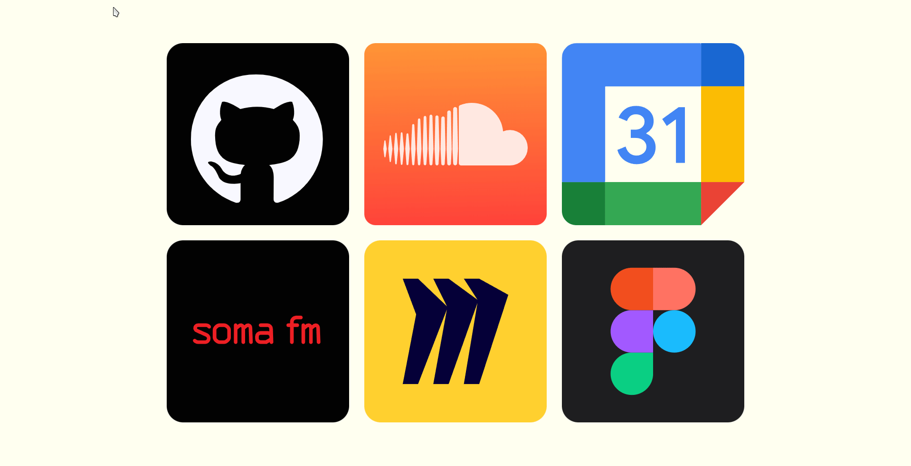

# Startpage

### Requirements

Node and npm. Tested only on Manjaro Linux

### Setup

1. Run `scripts/build.sh`
2. Create `backend/.env` file and add in PORT and MODE variables where MODE is either `production` or `entertainment` (this changes which apps are displayed by default)
3. Run `scripts/startup.sh` (or `node index.js` in `backend`) to launch

### Autostarting

For systemd based distros, there is `scripts/startpage.service` for autostarting Node. Autostarting Firefox in Kiosk mode can be done with `scripts/kiosk.desktop`

### License

MIT
